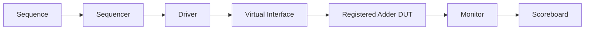

# UVM Verification Environment for a Registered 8-Bit Adder

A beginner-friendly SystemVerilog/UVM verification project for a registered 8-bit adder.

The project demonstrates a complete UVM flow using randomized transactions, a sequencer, driver, monitor, agent, environment, scoreboard, and test. It was developed as a hands-on learning exercise while studying introductory UVM concepts and Doulos-style verification practices.

> *This is an independent educational project and is not an official Doulos repository.*

---

## Live Demo

Run the project on EDA Playground:

👉 **[https://www.edaplayground.com/x/gQKM](https://www.edaplayground.com/x/gQKM)**

### Recommended settings:
- **Language**: SystemVerilog
- **Methodology**: UVM 1.2
- **Simulator**: Cadence Xcelium

---

## Verification Goals

The testbench verifies that the DUT correctly calculates:

$$\text{out} = \text{in1} + \text{in2}$$

for randomized 8-bit input values.

The verification environment:
- Generates 10 randomized transactions
- Drives the operands into the DUT
- Observes the registered output
- Calculates the expected result independently
- Compares expected and actual values
- Reports pass/fail results
- Confirms that every generated transaction was checked

---

## DUT

The DUT is a registered 8-bit adder with a 9-bit output to preserve the carry bit.

```systemverilog
always_ff @(posedge clk or posedge reset) begin
  if (reset)
    out <= '0;
  else
    out <= in1 + in2;
end
```

---

## Testbench Architecture



### Component Responsibilities

| Component | Responsibility |
| :--- | :--- |
| **Transaction** | Stores randomized operands and the observed result |
| **Sequence** | Generates randomized test transactions |
| **Sequencer** | Supplies transactions to the driver |
| **Driver** | Applies operands to the DUT interface |
| **Monitor** | Observes DUT inputs and output |
| **Scoreboard** | Calculates the expected sum and compares it with the DUT output |
| **Agent** | Groups the sequencer, driver, and monitor |
| **Environment** | Connects the agent to the scoreboard |
| **Test** | Creates the environment and starts the sequence |

---

## Repository Structure

```text
.
├── rtl/                        # Design Under Test (DUT)
│   ├── design.sv               #   8-bit adder with synchronous reset
│   └── README.md
│
├── tb/                         # UVM Testbench
│   ├── interface/              #   Virtual interface
│   │   └── add_if.sv           #     Adder interface
│   ├── pkg/                    #   UVM Package
│   │   └── adder_pkg.sv        #     Package & includes
│   ├── seq_lib/                #   Sequence library
│   │   ├── adder_transaction.svh  # Sequence item (randomized operands)
│   │   ├── adder_sequence.svh     # Stimulus sequence
│   │   └── adder_sequencer.svh    # Sequencer
│   ├── agent/                  #   Agent components
│   │   ├── adder_driver.svh    #     Pin-level driver
│   │   ├── adder_monitor.svh   #     Passive monitor
│   │   └── adder_agent.svh     #     Agent (driver + sequencer + monitor)
│   ├── env/                    #   Environment
│   │   ├── adder_scoreboard.svh#     Self-checking scoreboard
│   │   └── adder_env.svh       #     Top-level environment
│   ├── tests/                  #   Test classes
│   │   └── adder_test.svh      #     Base test
│   ├── top/                    #   Testbench top module
│   │   └── tb_top.sv           #     Clock, reset, DUT instantiation
│   └── README.md
│
├── sim/                        # Simulation scripts & logs
│   ├── Makefile                #   Multi-simulator Makefile
│   ├── run_edaplayground.sv    #   EDA Playground flat-file reference
│   ├── passing_run.log         #   Passing test simulation log
│   ├── injected_bug_run.log    #   Failing test simulation log
│   └── README.md
│
├── docs/                       # Documentation
│   ├── architecture.md         #   UVM Architecture diagram & overview
│   └── README.md               #   Detailed documentation & learning notes
│
└── README.md
```

---

## Important Design Decisions

- **Procedural sequence flow**: The sequence uses explicit UVM calls:
  ```systemverilog
  start_item(req);
  req.randomize();
  finish_item(req);
  ```
  instead of the `` `uvm_do `` macro. This keeps the sequence flow easier to understand, debug, and explain.

- **Virtual interface configuration**: The interface is passed to the driver and monitor through `uvm_config_db`.

- **Independent monitoring**: The monitor creates a fresh transaction object for every observed DUT operation and sends it to the scoreboard through a UVM analysis port.

- **Deterministic timing**: The driver applies operands on the negative clock edge. The DUT updates its registered output on the following positive edge. The monitor samples the completed result immediately after that positive edge.

- **QA-focused completeness check**: The scoreboard checks both whether each observed output is correct and whether all planned transactions were actually observed and checked.

---

## Expected Output

A successful run should end with:

```text
CHECKED: 10 | PASSED: 10 | FAILED: 0
```

and:

```text
UVM_WARNING : 0
UVM_ERROR   : 0
UVM_FATAL   : 0
```

---

## Negative-Test Validation

To confirm that the scoreboard detects defects, temporarily change:

```systemverilog
out <= in1 + in2;
```

to:

```systemverilog
out <= in1 + in2 + 1;
```

The simulation should then report scoreboard mismatches. Restore the correct DUT afterward.

---

## Concepts Demonstrated

- SystemVerilog classes and inheritance
- Constrained randomization
- UVM sequence items and sequences
- Sequencer-driver communication
- Virtual interfaces
- Active/passive agent structure
- Passive monitoring
- Analysis ports and exports
- Scoreboard-based checking
- UVM objections
- `report_phase`
- Pass/fail and completeness reporting

---

## Future Work

Features to be added in future iterations:
- Functional coverage
- SystemVerilog assertions
- Multiple test scenarios
- Factory overrides
- Register abstraction layer
- Automated regression infrastructure
- Advanced protocol handling
- Add boundary-value sequences
- Add directed tests for `0 + 0` and `255 + 255`
- Add a deliberately failing regression test
- Add CI automation for compilation and regression execution

---

## Learning References

The implementation was informed by:
- Doulos introductory UVM learning material
- Doulos Easier UVM coding guidelines
- UVM 1.2 concepts and documentation
- VLSI Verify UVM adder tutorial

*The project was independently organized and adapted for learning purposes.*

---

## Author

**Abdelrahman Yasser**  
QA / Software Engineer in Test (SDET) exploring AI-assisted testing and UVM hardware verification.
