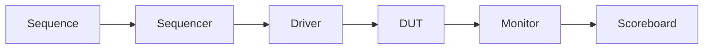

# Architecture Overview

This document describes the UVM testbench architecture for the 8-bit adder design.

## Component Block Diagram

## Component Breakdown

1. **Sequence (`adder_sequence`)**: Generates constrained random transaction items containing operands (`ip1`, `ip2`).
2. **Sequencer (`adder_sequencer`)**: Controls transaction flow from sequence to driver.
3. **Driver (`adder_driver`)**: Drives operands onto the virtual interface pins connected to the DUT.
4. **DUT (`adder`)**: 8-bit synchronous adder module.
5. **Monitor (`adder_monitor`)**: Passively samples signals from the virtual interface and sends transactions to the scoreboard via TLM analysis ports.
6. **Scoreboard (`adder_scoreboard`)**: Compares DUT outputs against expected mathematical results (`ip1 + ip2`) and reports verification pass/fail status.
